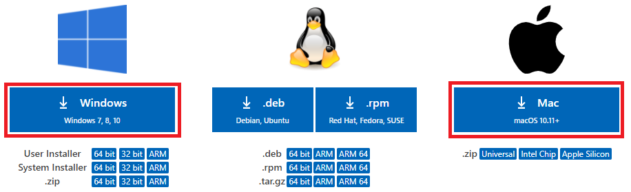

## 1-1-1. VSCode のダウンロード
プラグインを作るには、  
プログラムを書くための専用のアプリが必要になります。

メモ帳などでもプラグイン開発は可能ですが、  
無料の `VSCode` が便利なので、インストールしていきましょう。

### 1. VSCode(Visual Studio Code) の公式サイトへアクセス
下記URLにアクセスします。  
https://azure.microsoft.com/ja-jp/products/visual-studio-code/

### 2.『Download Now』を選択
『Download Now』を選択してください。

### 3. 使用しているパソコンのOSに合わせてダウンロード
使用しているパソコンのOSに合わせて `赤枠` を選択してください。  
※ `赤枠` を選択した時点で、自動ダウンロードされます。

## 次の講座へ
次はインストールを実施していきます!

[次の講座へ](1-1-2.md)

## 前の講座に戻る
[前の講座に戻る](1-1.md)

## 講座の一覧に戻る
[講座の一覧に戻る](../README.md)
