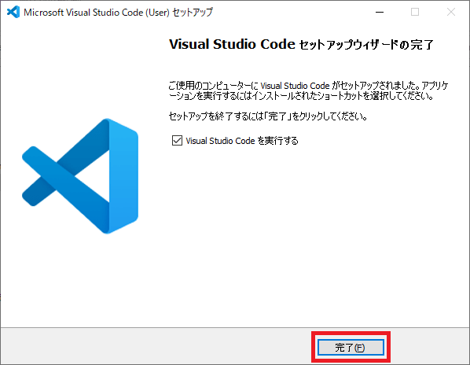

## 1-1-2. VSCode のインストール
Windows10 でのインストール手順を解説します。  
Mac の場合は手順が違うので『vscode インストール mac』で検索してみてください。  
※ 筆者が Mac を持っていないので、手順が書けませんでした。申し訳ないです。

### 1. ダウンロードした『VSCodeUserSetup-x64-X.XX.X.exe』を実行
ダウンロードした『VSCodeUserSetup-x64-X.XX.X.exe』を実行します。  
次の『使用許諾契約書の同意』画面がポップアップで表示されます。

### 2. 使用許諾契約書の同意
使用許諾契約書をよく読んだ上で『同意する』を選択、  
続いて『次へ』を選択してください。

### 3. インストール先の指定
『次へ』を選択してください。

### 4. スタートメニューフォルダーの指定
『次へ』を選択してください。

### 5. 追加タスクの選択
『デスクトップ上にアイコンを作成する』にチェックを入れて、  
『次へ』を選択してください。

### 6. インストール準備完了
『インストール』を選択してください。

### 7. インストール状況
インストールが終わるまで暫く待ちます。

### 8. Visual Studio Code セットアップウィザードの完了
『完了』を選択してください。直後に VSCode が起動します。  

### 9. VSCode の終了方法
画面右上の『×』ボタンを選択することで VSCode を終了できます。

## 次の講座へ
VSCode のインストールはこれで完了です。お疲れ様でした。  
次回からは、VSCode の初期設定を実施します。  

[次の講座へ](1-2.md)

## 前の講座に戻る
[前の講座に戻る](1-1-1.md)

## 講座の一覧に戻る
[講座の一覧に戻る](../README.md)
