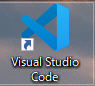
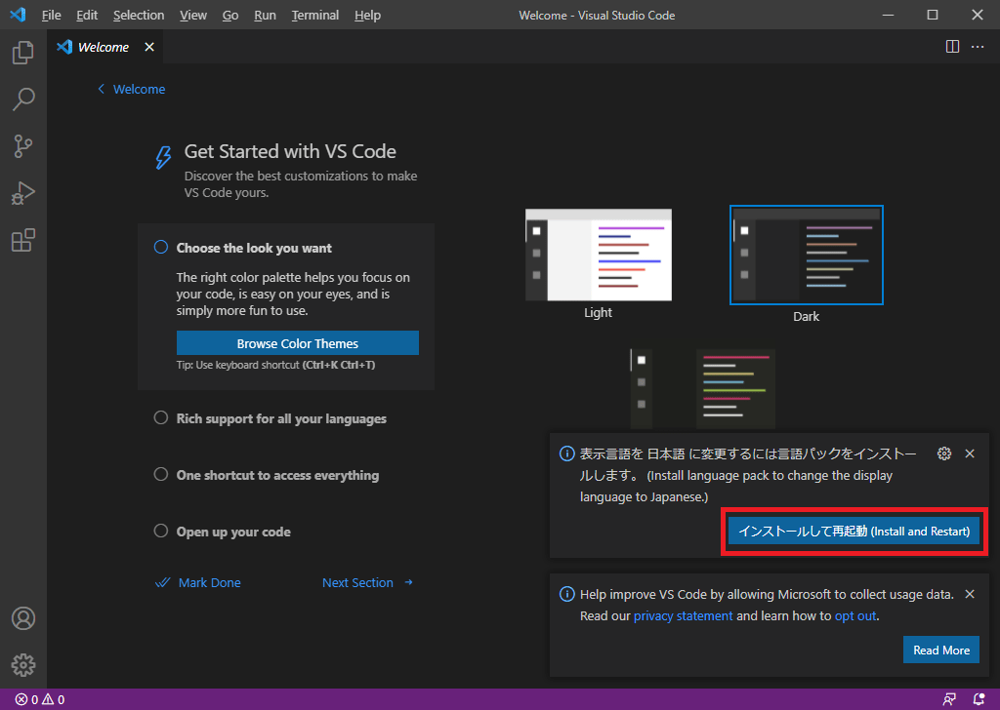
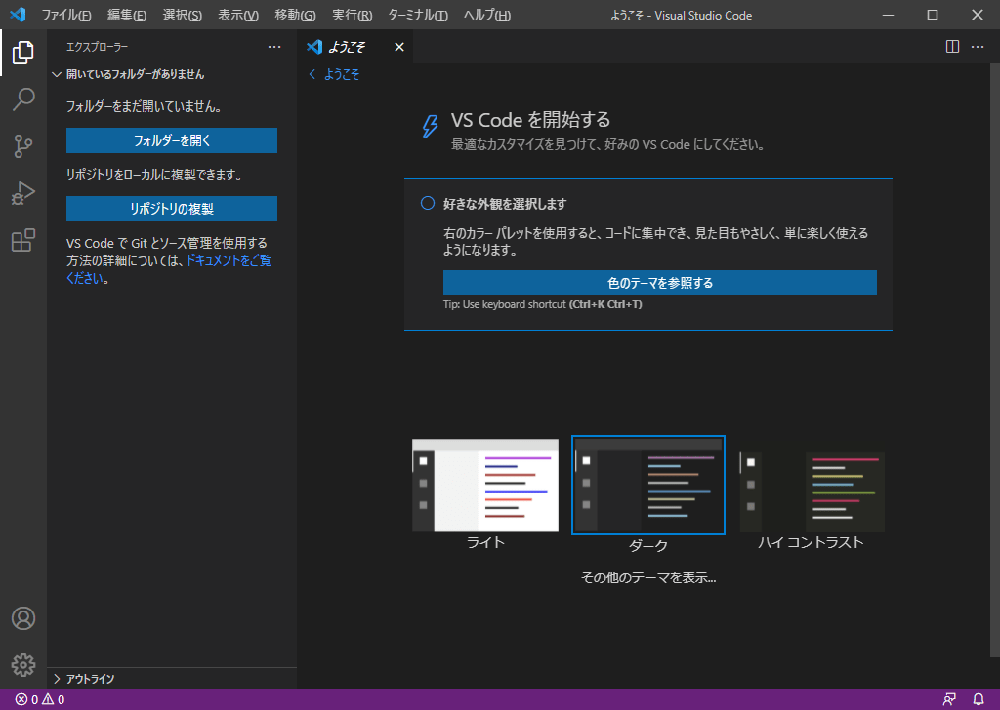

# 1-2. VSCodeのメニューを日本語に変更しよう

プリシア  
「VSCodeを開いて見たけど、英語ばかりで読めないよ!」

リード  
「メニューは英語だからね。  
日本語に変更する方法があるから、解説していくよ。」

## 1-2-1. メニューを日本語に変更
VSCode のメニューは最初は英語です。  
日本語の方が使いやすいと思うので、変更方法を解説します。

### 1. デスクトップアイコンから VSCode を起動
デスクトップに作成したアイコン『Visual Studio Code』を選択してください。

### 2. 拡張機能『Japanese Language Pack for Visual Studio Code』をインストール
画面右下に表示される『インストールして再起動(Install and Restart)』を選択してください。

### 3. メニューを日本語に変更完了
再起動後、以下のようにメニューが日本語になっていればOKです。

## 次の講座へ
次回は、テーマ(画面の見た目)の変更を実施します。

[次の講座へ](1-3.md)

## 前の講座に戻る
[前の講座に戻る](1-1.md)

## 講座の一覧に戻る
[講座の一覧に戻る](../README.md)
