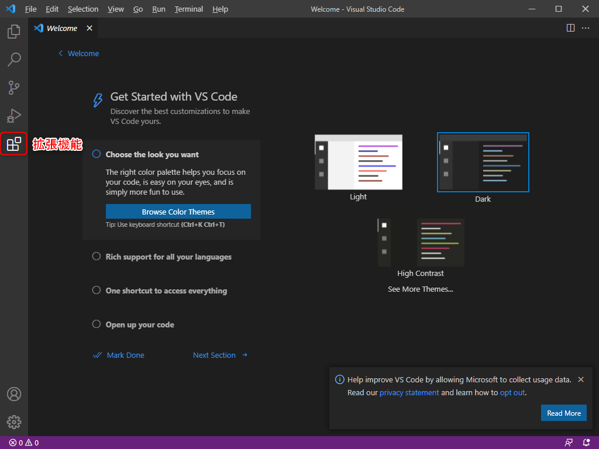
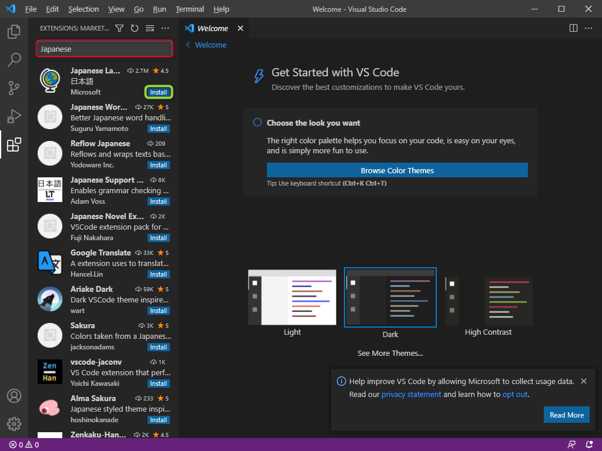
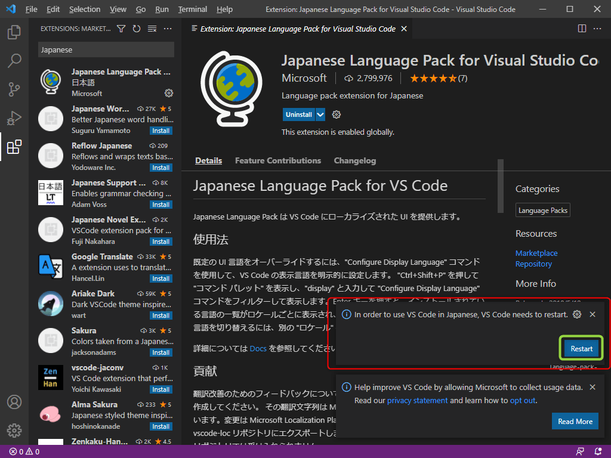
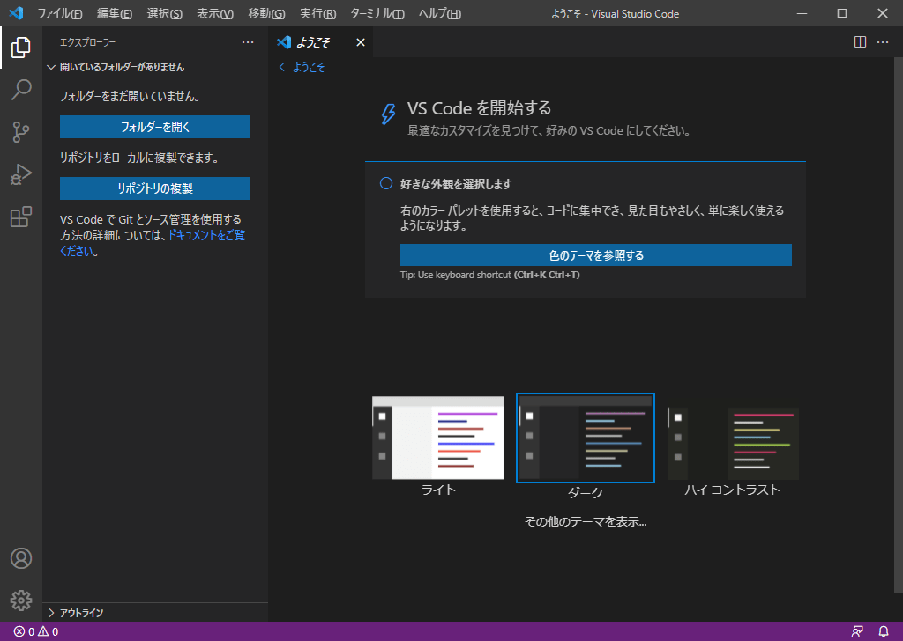

# 1-2/1. VSCodeのメニューを日本語に変更しよう
ここでは、日本語のメニュー変更を通常の方法で説明します。

### 1. 拡張機能を選択
画面左の拡張機能を選択します。

### 2. 拡張機能『Japanese Language Pack for Visual Studio Code』をインストール
`赤枠` の検索ボックスに 『Japanese』と入力し、`緑枠`の『Install』を選択します。

### 3. VSCode の再起動
`赤枠` のポップアップが表示されるので、`緑枠` の『Restart』を選択してください。

### 4. メニューを日本語に変更完了
再起動後、以下のようにメニューが日本語になっていればOKです。

## 次の講座へ
次回は、テーマ(画面の見た目)の変更を実施します。

[次の講座へ](../1-3.md)

## 前の講座に戻る
[前の講座に戻る](../1-1-2.md)

## 講座の一覧に戻る
[講座の一覧に戻る](../../README.md)
