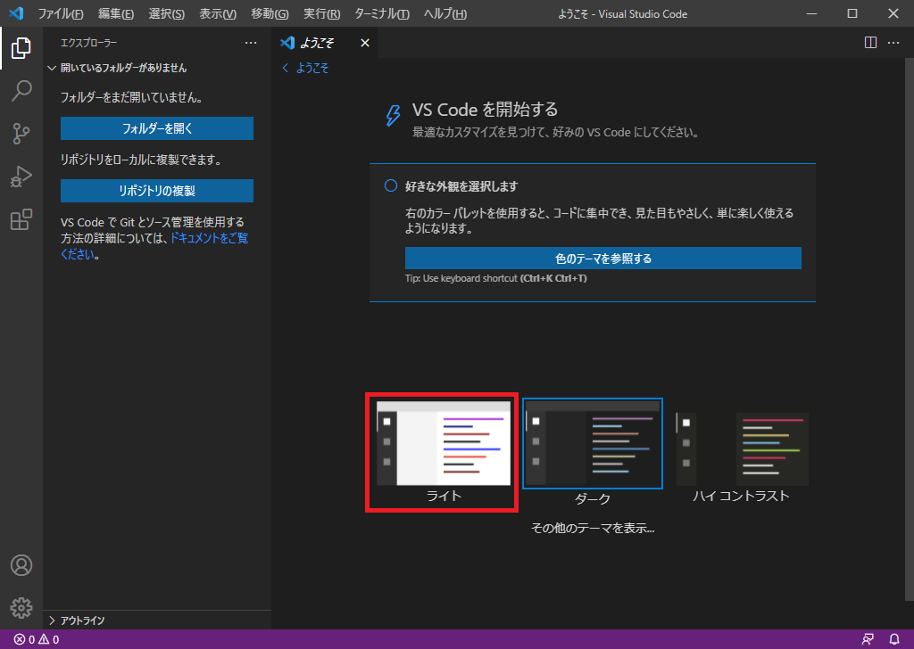
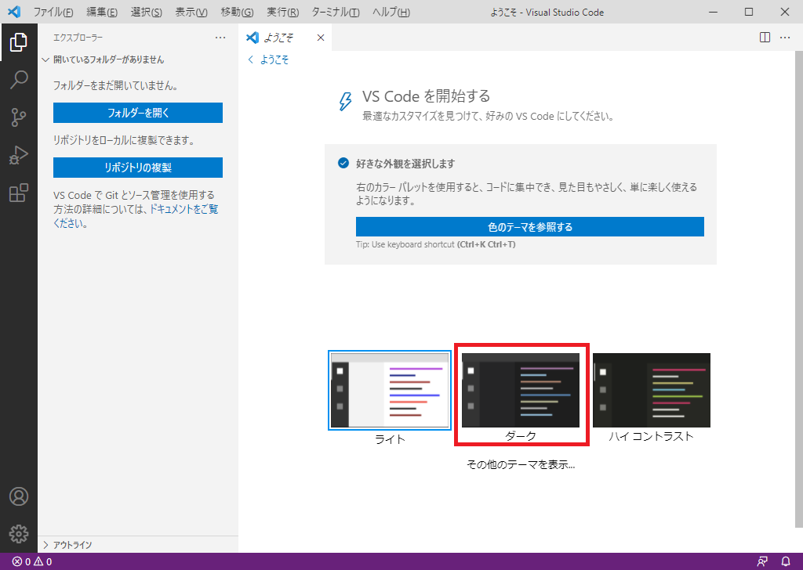

# 1-3. VSCodeのテーマを変更しよう

プリシア  
「VSCode の画面が真っ暗だよ!?」

リード  
「テーマの影響だね。  
テーマによっては、明るくしたりも出来るから  
自分好みのテーマに変更してみよう！」

## 1-3-1. テーマの変更
基本となる『ライトテーマ』と『ダークテーマ』の切り替えについて解説します。

### 1. ライトテーマに変更
`赤枠`で囲った『ライト』を選択してください。

### 2. ダークテーマに変更
`赤枠`で囲った『ダーク』を選択してください。

## Q&A
「もっと色んなテーマを試したいよ!」

「『ダークテーマ』の下にある『その他のテーマを表示』を選択すると、  
色んなテーマに出来るよ!」

「結構あるみたいだね。お気に入りのものを探してみるね!」

## 次の講座へ
解説では『ライトテーマ』の方を使用していきますが、  
『ライトテーマ』と『ダークテーマ』はどちらでも大丈夫です。  
自分の好みの方を選択してください。

次回は、RPGツクールMZで使用する方法を解説します。

[次の講座へ](1-4.md)

## 前の講座に戻る
[前の講座に戻る](1-2.md)

## 講座の一覧に戻る
[講座の一覧に戻る](../README.md)
