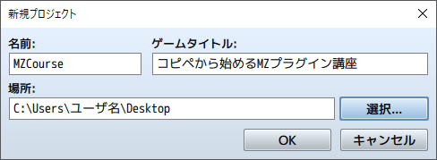
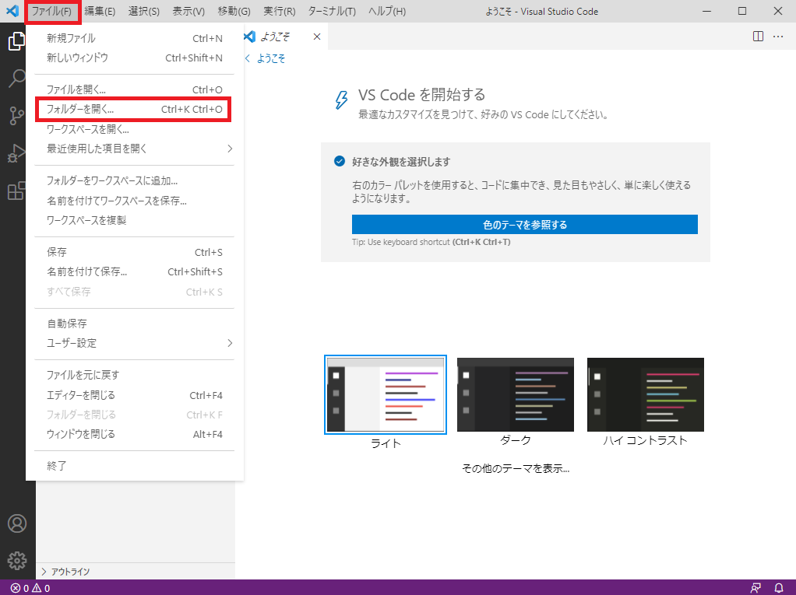
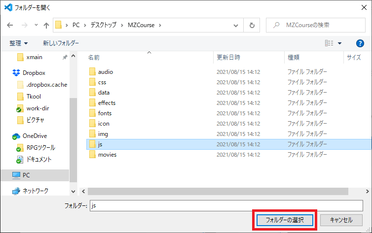
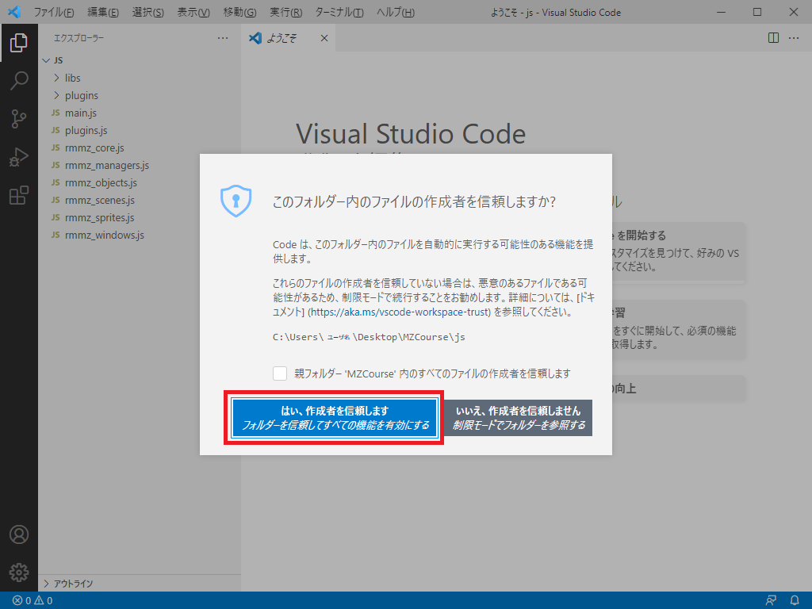
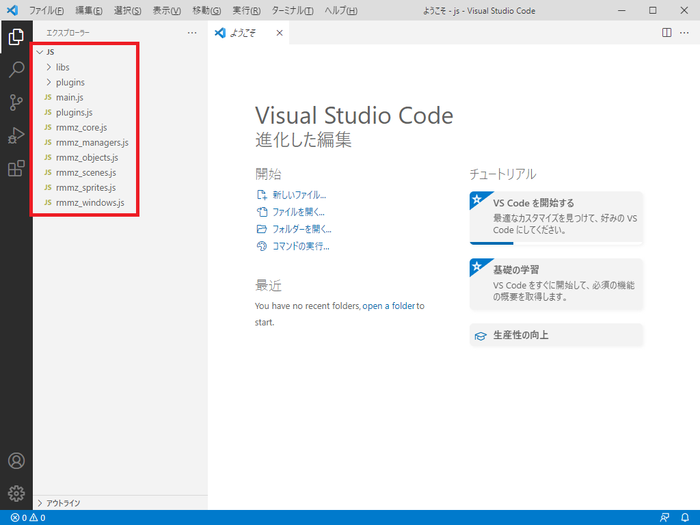

# 1-4. RPGツクールMZと連動しよう

リード  
「VSCode の設定が終わったから、  
次はRPGツクールMZと連動してみよう!」

プリシア  
「やったー! ついにRPGツクールMZの登場だ!」

## 1-4-1. RPGツクールMZと連動
RPGツクールMZと連動の手順を解説します。  

### 1. 新規プロジェクトの作成
RPGツクールMZで、新規プロジェクトを作成します。  
以下、構成で解説しますが、変えても特に影響はないと思います。

* 名前『MZCourse』
* ゲームタイトル『コピペから始めるMZプラグイン講座』
* 場所『日本語のフォルダー以外ならどこでも可能です』

### 2. VSCode との連携
続いて、VSCode を起動します。  
次に『ファイル』 > 『フォルダーを開く』を選択します。

### 3. VSCode で js フォルダーを読み込み
先ほど作ったプロジェクトを選択し、『js』フォルダーを選択します。  
次に『フォルダーの選択』を選択してください。

### 4. VSCode のセキュリティ確認
『はい、作成者を信頼します』を選択します。

### 5. RPGツクールMZとの連携完了の確認
`赤枠` の表示になっていれば完了です!

## 次の講座へ
次回で準備編の最後です!  
プラグインのコピー元となるテンプレートを作っていきます!

[次の講座へ](1-5.md)

## 前の講座に戻る
[前の講座に戻る](1-3.md)

## 講座の一覧に戻る
[講座の一覧に戻る](../README.md)
