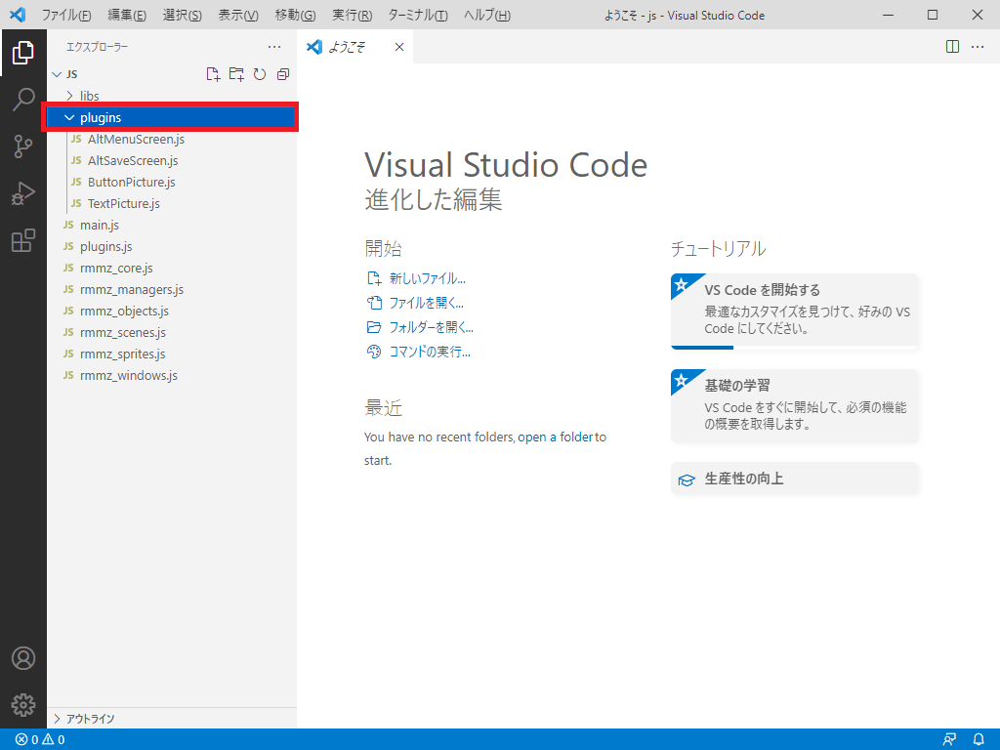
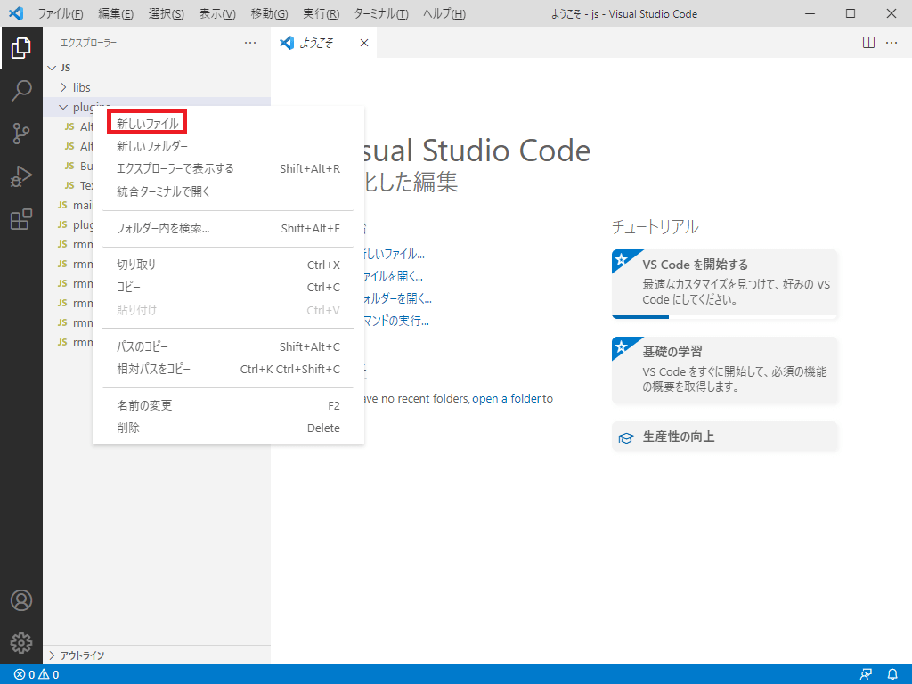
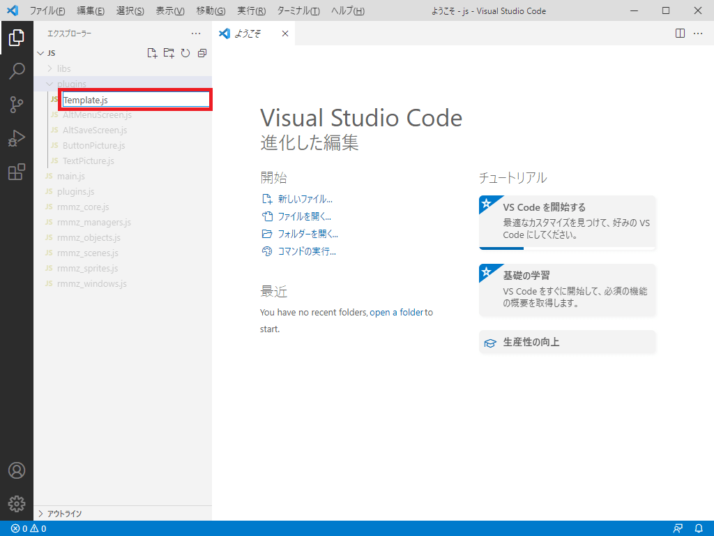
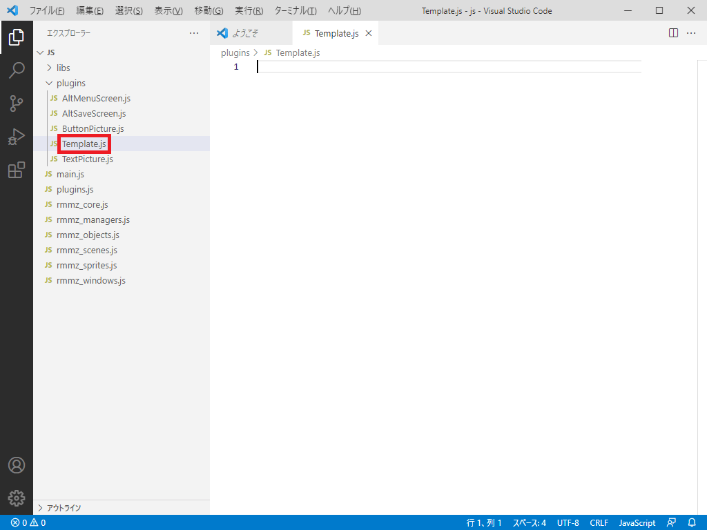
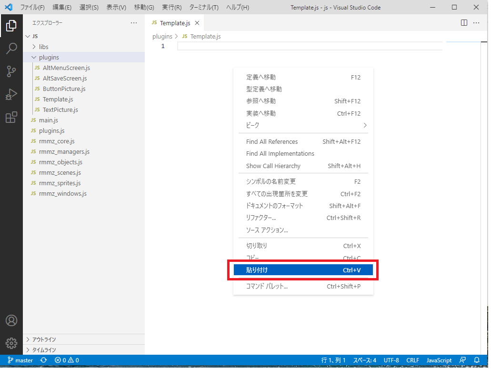
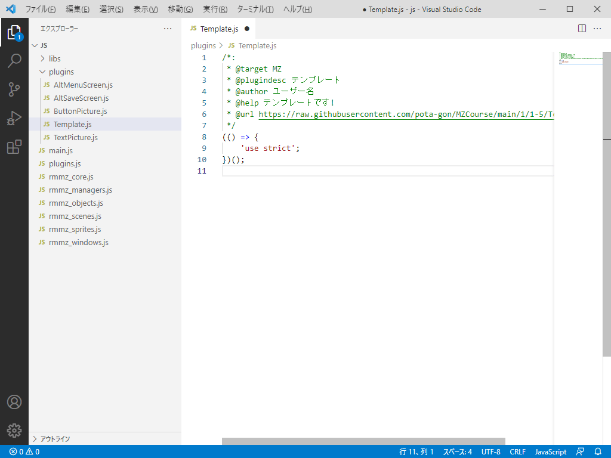
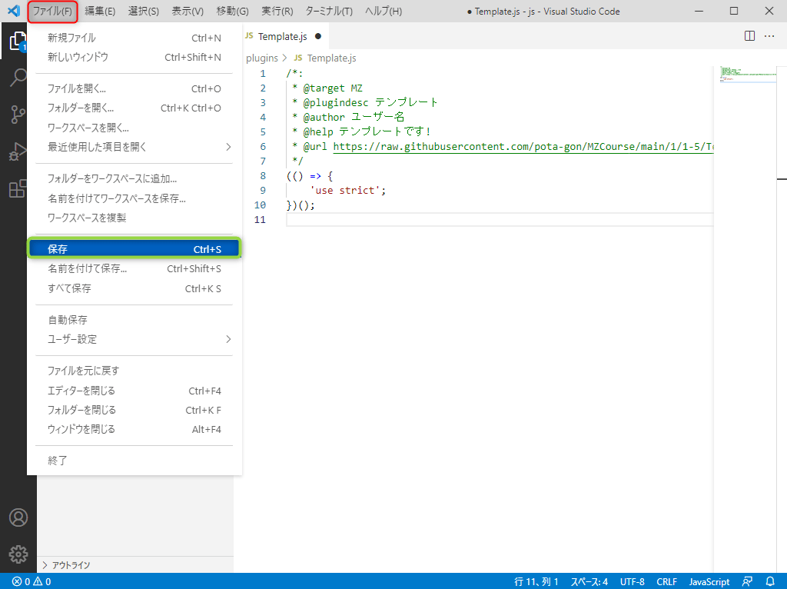
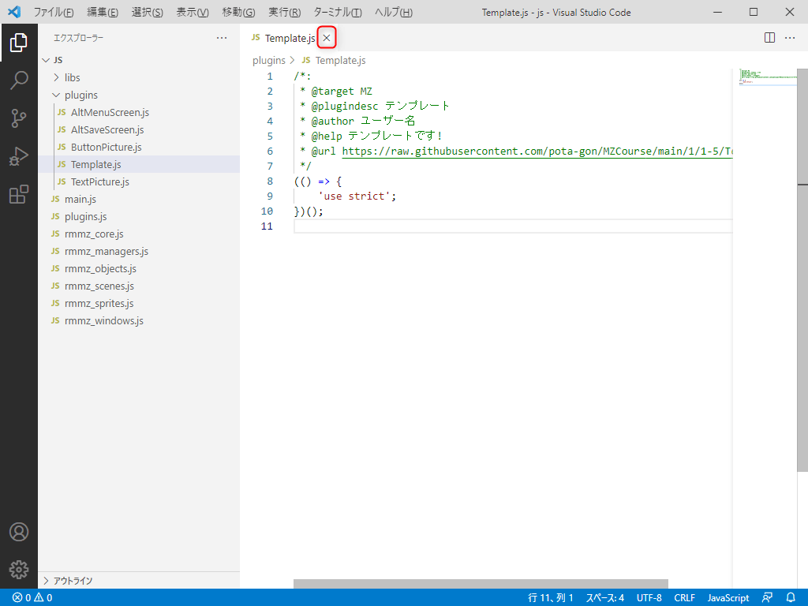
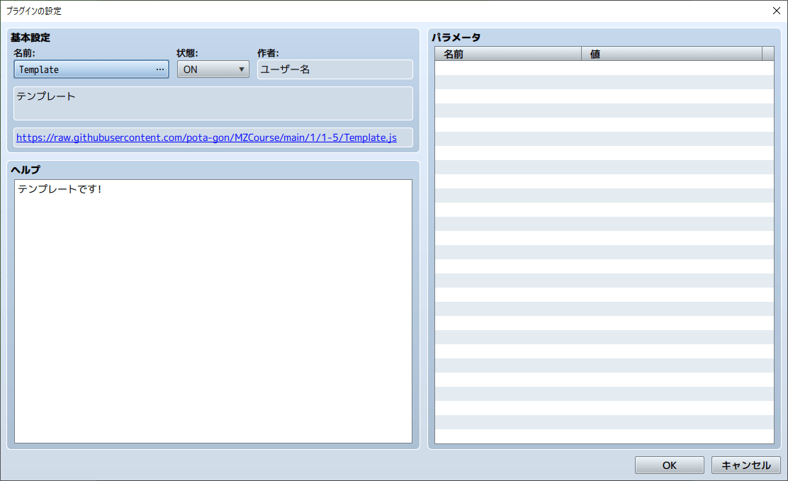

# 1-5. プラグインのテンプレートを作ってみよう!

リード  
「この講座で準備編は完了だよ!  
テンプレートを作ると効率が上がるので作っていこう!」


プリシア  
「気合入れていくわよ!」

## 1-5-1. テンプレートを作ろう
テンプレートとは、プラグインのコピー元となるサンプルです。  
新しくプラグインを作るときにテンプレートをコピーして開発すると  
効率よく開発することができるので、作成していきましょう。

### 1. plugins フォルダーを選択
『plugins』フォルダーを選択します。



### 2. 新しいファイルを作成
『plugins』フォルダー上で右クリック(Mac はControl + クリック)で  
表示される 『新しいファイル』を選択します。



### 3. テンプレート名を記載する
入力欄に切り替わるので『Template.js』と入力してEnterキーを押してください。



### 4. テンプレートの作成確認
『Template.js』が作成できたことを確認します。  
`赤枠`の部分に『Template.js』が出来ていればOKです。



### 5. テンプレートのコピー
下記コードをコピーします。コードの右上(灰色になっている所の右上)にカーソルを置くと  
コピーマークが出るので、クリックで簡単にコピー出来ます。

```js
/*:
 * @target MZ
 * @plugindesc テンプレート
 * @author ユーザー名
 * @help テンプレートです!
 * @url https://raw.githubusercontent.com/pota-gon/MZCourse/main/1/1-5/Template.js
 */
(() => {
    'use strict';
})();
```

### 6. テンプレートの貼り付け
右の白い余白で右クリック(Mac はControl + クリック)をして、『貼り付け』を選択します。  
この操作はキーボードの『Ctrl + V』でも可能です。



### 7. テンプレートの貼り付け確認
貼り付けると右の余白部分に、テンプレートの内容が記載されます。



### 8. テンプレートの保存
次に『ファイル』 > 『保存』を選択します。  
この操作はキーボードの『Ctrl + S』でも可能です。



### 9. テンプレートの保存
`赤枠` の部分が『●』から『×』に変わっていれば保存完了です。  



### 10. RPGツクールMZ上でのプラグイン確認
RPGツクールMZを起動します。  
『ツール』>『プラグイン管理』から、通常のプラグインと同じように確認し『Template』を選択します。

画面キャプチャのようになってたら、テンプレートの作成は完了です!  
※ テンプレートはプラグインとしては使わないので『キャンセル』で登録せずに終了してください。

上手く表示されない場合は、[こちら](https://raw.githubusercontent.com/pota-gon/MZCourse/main/1/1-5/Template.js) からダウンロードして  
plugins フォルダーに配置してください。



## 次の講座へ
準備編はこれで完成です!  
次はプラグイン開発になります!

[次の講座へ](../2/2-1.md)

## 前の講座に戻る
[前の講座に戻る](1-4.md)

## 講座の一覧に戻る
[講座の一覧に戻る](../README.md)
