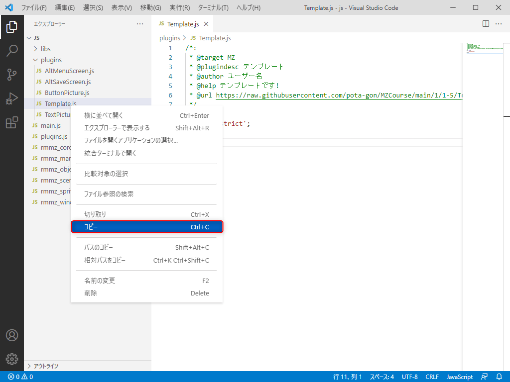
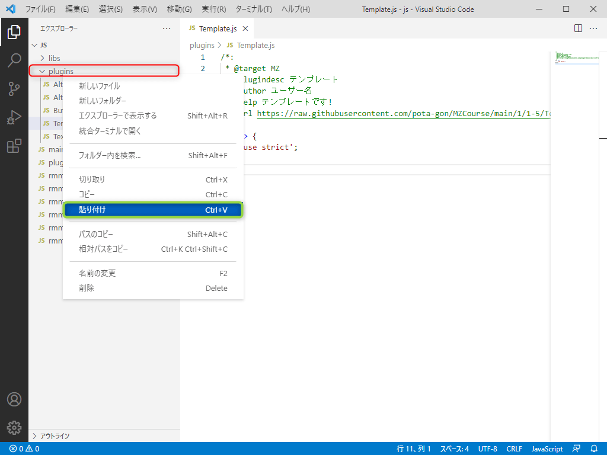
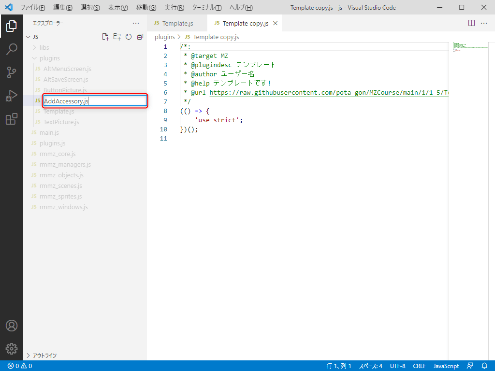
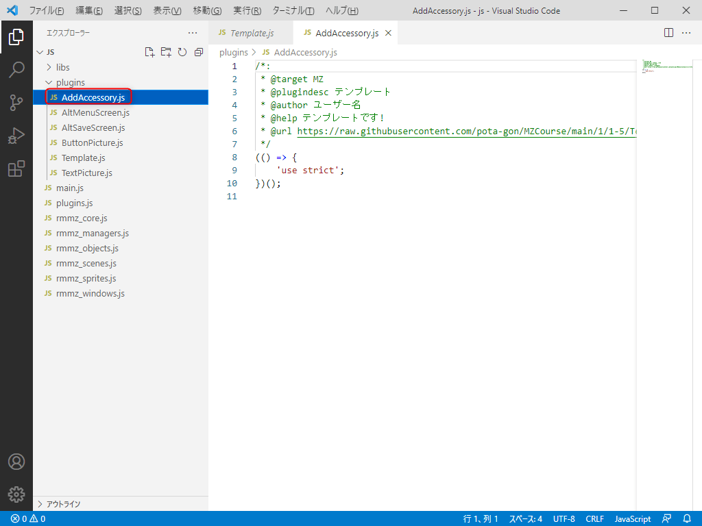

## 2-1-1. テンプレートをコピーしよう
プラグインを作成するときは、テンプレートをコピーした方が簡単なので、  
前回のプラグイン講座で作ったテンプレートをVSCode上でコピーする方法を解説します。

### 1. テンプレートを選択
前回の講座で作った『Template.js』を選択します。

第2章から始めた人は [こちら](https://raw.githubusercontent.com/pota-gon/MZCourse/main/1/1-5/Template.js) からテンプレートを  
ダウンロードして『plugins』フォルダーに配置してください。

### 2. テンプレートをコピー
『Template.js』上で右クリック(Mac はControl + クリック)で表示される『コピー』を選択します。  
この操作はキーボードの『Ctrl + C』でも可能です。

### 3. テンプレートの貼り付け
『plugins』フォルダーにカーソルを合わせて、  
右クリック(Mac はControl + クリック)で表示される『貼り付け』を選択します。  
この操作はキーボードの『Ctrl + V』でも可能です。

### 4. テンプレートの貼り付け確認
『Template copy.js』が出来ていれば、テンプレートのコピーは完了です。

### 5. 名前の変更
『Template copy.js』上で右クリック(Mac はControl + クリック)で表示される『名前の変更』を選択します。  
この操作はキーボードの『F2』でも可能です。

### 6. プラグイン名を変更
入力欄に切り替わるので『AddAccessory.js』と書き換えて Enter キーを押してください。

### 7. 名前変更の確認
『AddAccessory.js』が作成できたことを確認します。  
`赤枠`の部分に『AddAccessory.js』が出来ていればOKです。

## 次の講座へ
続いてプラグイン情報を変更します。

[次の講座へ](2-1-2.md)

## 前の講座に戻る
[前の講座に戻る](2-1.md)

## 講座の一覧に戻る
[講座の一覧に戻る](../README.md)
