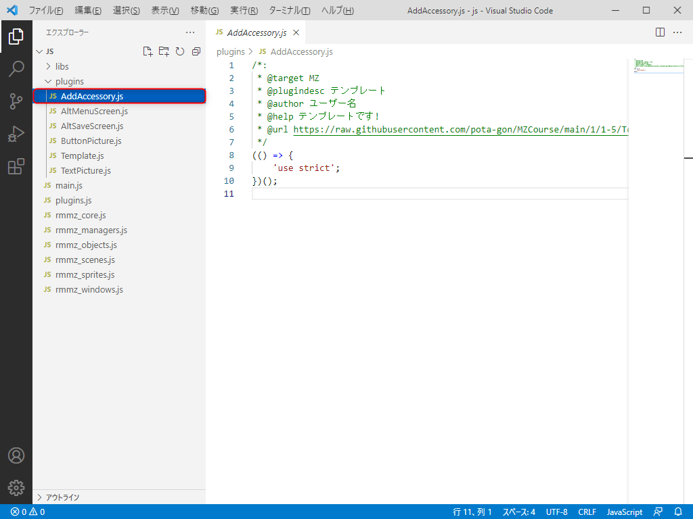
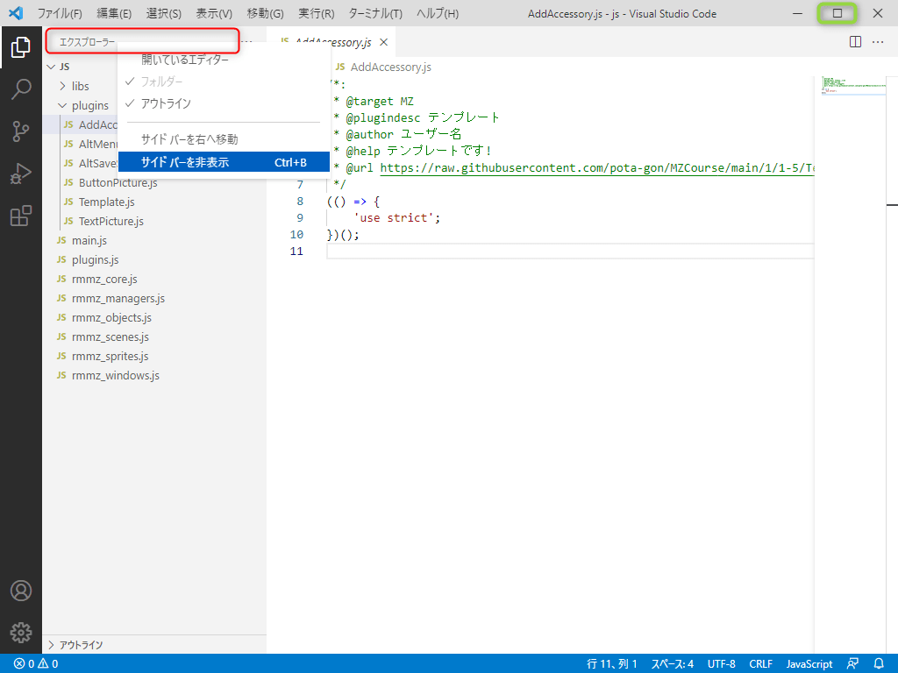
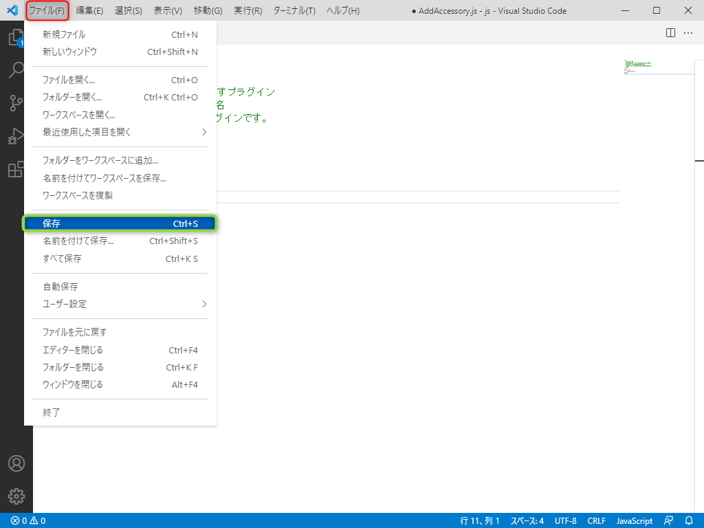
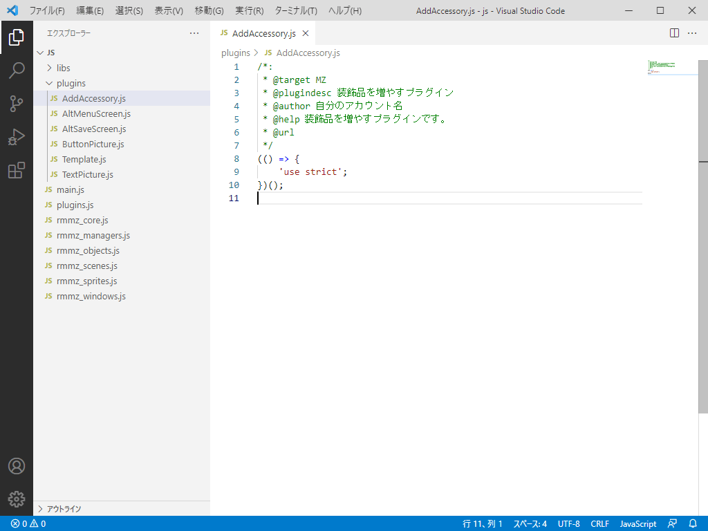

## 2-1-2. プラグイン情報を変更しよう
テンプレートをコピーした状態なので、『装飾品を増やすプラグイン』と分かるように  
プラグイン情報を変更しましょう。

### 1. 『AddAccessory.js』を選択
『plugins』> 『AddAccessory.js』を選択します。

### 2. 表示領域の確保
URLの一部が見えないので、以下のどちらかで表示領域を確保しましょう。  
※ A. の方法で解説していきます。

**A.『エクスプローラー』上で右クリック(Mac はControl + クリック)で『サイドバーを非表示』を選択**  
=> この操作はキーボードの『Ctrl + B』でも可能です。  
**B. 画面右上の最大化ボタンを選択します。**

### 3. 表示領域の確保確認
キャプチャのように『サイドバー』がなくなればOKです。

### 4. 装飾品を増やすプラグインの情報に変更
VSCode の書き方はメモ帳などのアプリと基本同じなので、  
以下のように変更してください。

* `@plugindesc テンプレート` => `@plugindesc 装飾品を増やすプラグイン`
* `@author ユーザー名` => `@author 自分のアカウント名`
* `@help テンプレートです!` =>  `@help 装飾品を増やすプラグインです。`
* `@url https://raw.githubusercontent.com/pota-gon/MZCourse/main/1/1-5/Template.js` => `@url `

### 5. 変更の確認
以下のようになっていればOKです。

### 6. プラグインの保存
次に『ファイル』 > 『保存』を選択します。  
この操作はキーボードの『Ctrl + S』でも可能です。

### 7. サイドバーの表示
キーボードの『Ctrl + B』で、サイドバーを表示します。

### 8. RPGツクールMZ上でのプラグイン確認
RPGツクールMZを起動します。  
『ツール』>『プラグイン管理』から、通常のプラグインと同じように確認し『AddAccessory』を選択します。

上手く表示されない場合は、[こちら](https://raw.githubusercontent.com/pota-gon/MZCourse/main/2/2-1-2/AddAccessory.js) からダウンロードして  
plugins フォルダーに配置してください。

### 9. プラグインをONにする
『AddAccessory』をONにした状態で終了してください。

## 次の講座へ
次は、装飾品を2つに増やす講座です!

[次の講座へ](2-1-3.md)

## 前の講座に戻る
[前の講座に戻る](2-1-1.md)

## 講座の一覧に戻る
[講座の一覧に戻る](../README.md)
