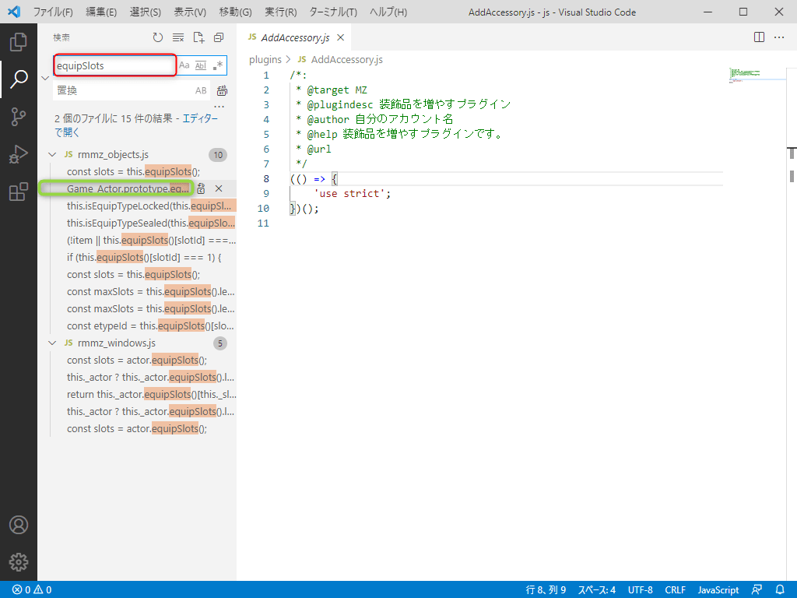
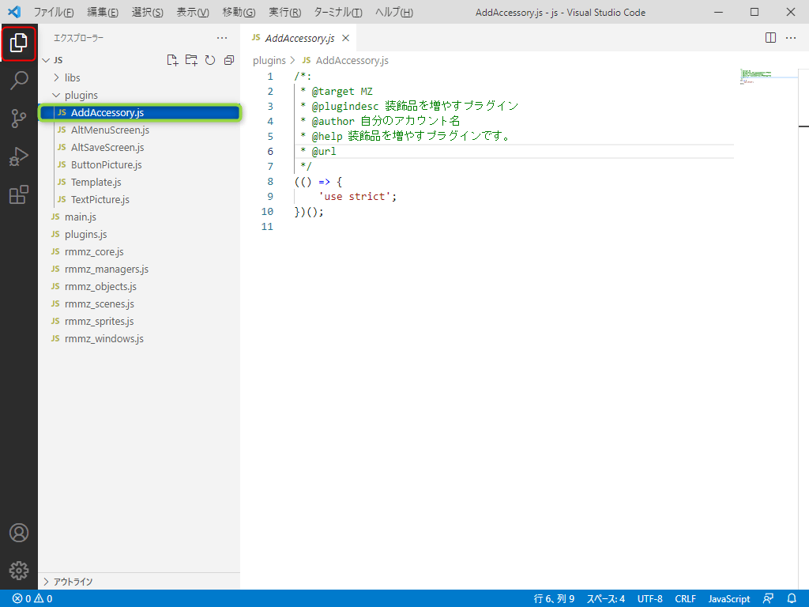
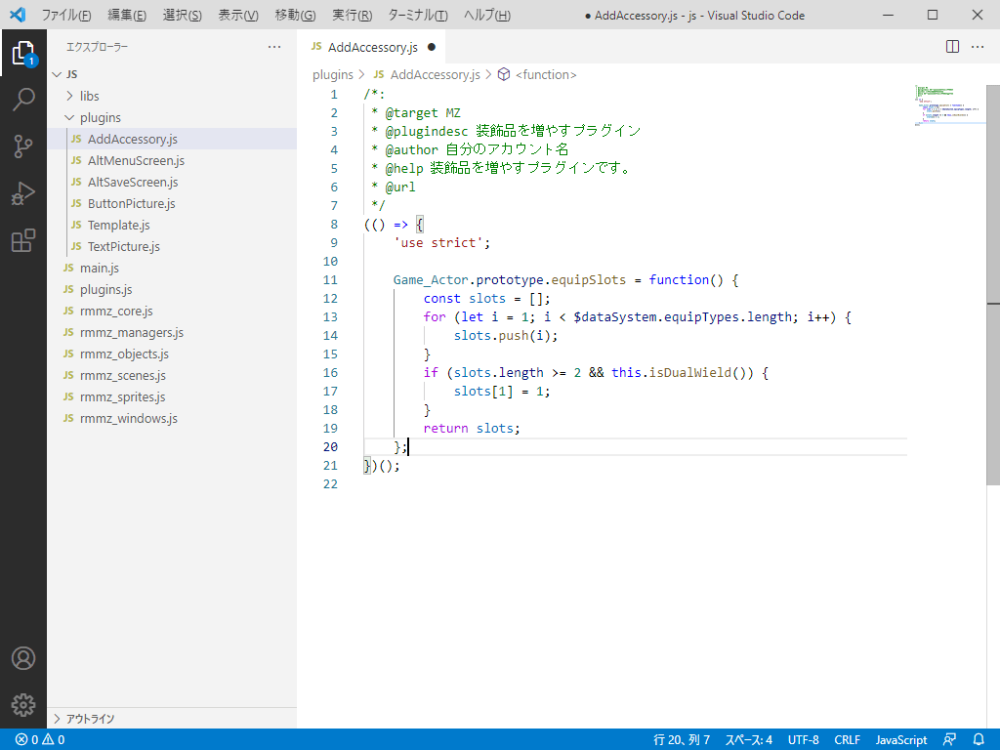

## 2-1-3. 装飾品を2つにしよう!
いよいよ中身の装飾品を2つにする部分に対応します!  
装飾品を増やすための方法をコアスクリプトから探して行きましょう!

### 1. 装飾品を2つに増やす方法を探そう
画面左上の『検索ボタン』を選択します。

### 2. 検索画面の確認
『検索画面』に切り替わったことを確認します。  
`赤枠` のようになっていればOKです。

### 3. 検索の実行
`赤枠` の検索ボックスに 『equipSlots』と入力し、`緑枠` の部分を選択します。

### 4. 検索結果の確認
`赤枠` の部分が表示されることを確認できればOKです。

### 5. 検索結果のコピー
検索結果を範囲選択し、右クリック(Mac はControl + クリック)で『コピー』を選択してください。  
コピーはキーボードの『Ctrl + C』でも可能です。

### 6. エクスプローラーに戻る
画面左上の `赤枠` の『エクスプローラー』を選択します。  
次に `緑枠` の『AddAccessory.js』を選択します。

### 7. 検索結果の貼り付け
『'use strict';』の下に改行を挿入し、右クリック(Mac はControl + クリック)で表示される『貼り付け』を選択します。  
貼り付けはキーボードの『Ctrl + V』でも可能です。

### 8. 装飾品を2つに増やす処理の追加
『slots.push(5);』を `赤枠` の19行目に追加してください。  
次に『ファイル』 > 『保存』を選択します。  
保存はキーボードの『Ctrl + S』でも可能です。

### 9. RPGツクールMZ上でのプラグイン確認
前回の講座で『AddAccessory』はONになっているはずですが、ONにしてなかったらONにしましょう。  
RPGツクールMZで、テストプレイを実施します。
画面キャプチャの `赤枠` のように装飾品が追加されてればOKです。

上手く表示されない場合は、[こちら](https://raw.githubusercontent.com/pota-gon/MZCourse/main/2/2-1-3/AddAccessory.js) からダウンロードして  
plugins フォルダーに配置してください。

## 次の講座へ
次はアノテーションを解説していきます!

[次の講座へ](2-1-4.md)

## 前の講座に戻る
[前の講座に戻る](2-1-2.md)

## 講座の一覧に戻る
[講座の一覧に戻る](../README.md)
