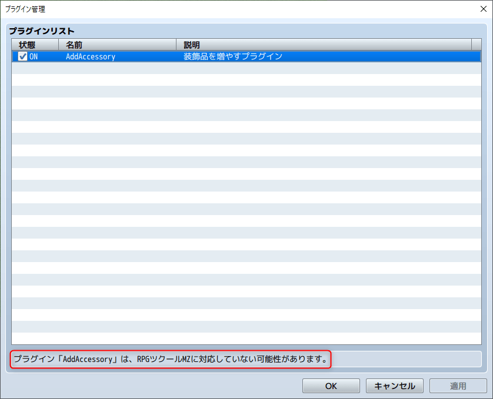
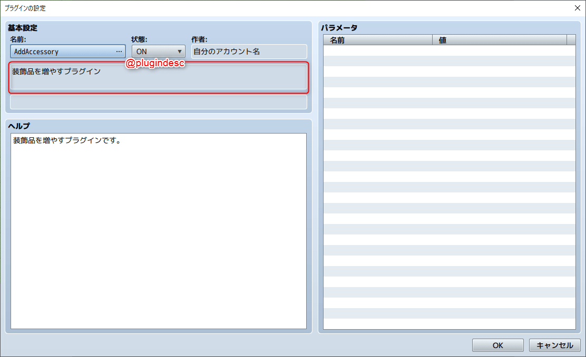
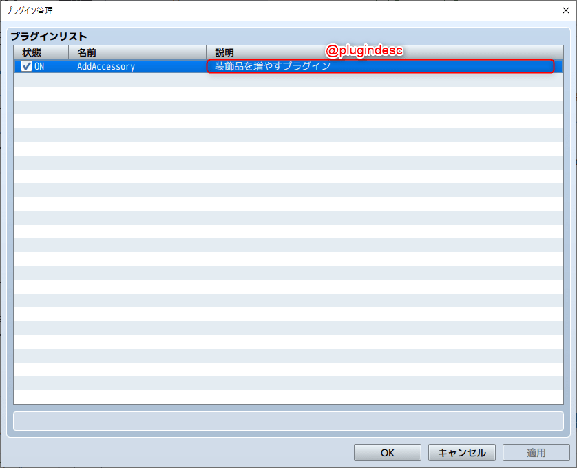
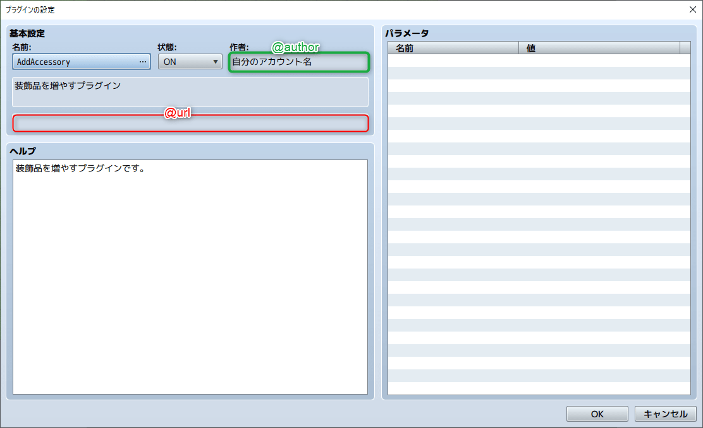
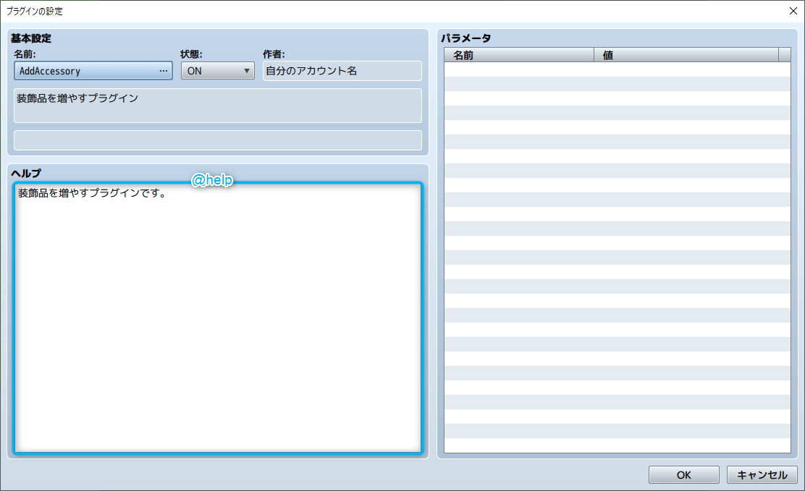
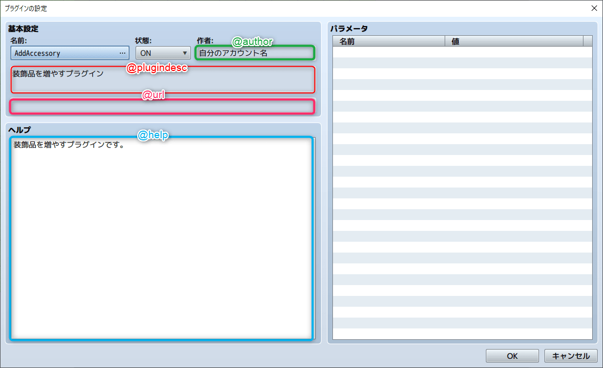

## 2-1-4. アノテーションの解説

プリシア  
「アノテーションって何だろ～?」


リード  
「下の `/*: */` で囲まれた部分にプラグインの情報を記載できるんだ!  
今回は基本的なアノテーションについて解説していくよ!」

```js
/*:
 * @target MZ
 * @plugindesc 装飾品を増やすプラグイン
 * @author 自分のアカウント名
 * @help 装飾品を増やすプラグインです。
 * @url 
 */
 ```

### 1. @target について

「`@target MZ` の部分だね。  
RPGツクールMZ用のプラグインと認識するための情報だよ!」


「書かないとどうなるんだ?」


「`赤枠` の部分『プラグイン「○○」は、  
RPGツクールMZに対応していない可能性があります。』のエラーが出てしまうんだ!」




「RPGツクールMZのプラグインを作るときは必ず書いた方が良さそうね。」


「そうだね! RPGツクールMZのプラグインを作るときは必ず記載しよう!」

### 2. @plugindesc について

「`@plugindesc 装飾品を増やすプラグイン` の部分だよ。  
プラグインの名前や概要などを書けるよ!」




「プラグインリストの `赤枠` 部分にも表示されるから、  
分かりやすい情報を記載しよう!」



### 3. @author, @url について

「`@author` と `@url` だね。  
プラグインを配布するときに使う  
作者の名前(@author)と配布先のURL(@url)になるよ!  
配布する予定がなければ特に記載しなくても大丈夫だよ!」



### 4. @help について

「`@help` だね。  
プラグインの説明を記載出来るよ!」



### 5. まとめ

「最後にアノテーションのまとめだよ!  
どこに表示されるか覚えておこう!」

```js
/*:
 * @target MZ
 * @plugindesc 装飾品を増やすプラグイン
 * @author 自分のアカウント名
 * @help 装飾品を増やすプラグインです。
 * @url 
 */
 ```



## 次の講座へ
次は装飾品を増やすプラグインの解説をしていきます!

[次の講座へ](2-1-5.md)

## 前の講座に戻る
[前の講座に戻る](2-1-3.md)

## 講座の一覧に戻る
[講座の一覧に戻る](../README.md)
