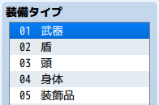

## 2-1-5. 装飾品を増やすプラグインの解説

リード  
「次は装飾品を増やすプラグインの解説をしていくよ!」

```js
Game_Actor.prototype.equipSlots = function() {
    const slots = [];
    for (let i = 1; i < $dataSystem.equipTypes.length; i++) {
        slots.push(i);
    }
    if (slots.length >= 2 && this.isDualWield()) {
        slots[1] = 1;
    }
    slots.push(5);
    return slots;
};
```

### 1. 関数 について

「以下の部分を関数って言うんだ。  
`{}` の中に様々な処理が入るんだ!」

```js
Game_Actor.prototype.equipSlots = function() {
};
```


「関数は、イベントみたいなものかな?」


「そうだね!  
この関数は、装備に関する処理が入っているよ。」


「`Game_Actor`って何だ?」


「ここには、アクターの情報が入るんだ!」


「`equipSlots`は装備関連の記載かしら?」


「そうだね。装備タイプの一覧を決める所だよ!」

### 2. 関数内の処理について

「次は、関数内の処理について解説するよ。」

```js
const slots = [];
for (let i = 1; i < $dataSystem.equipTypes.length; i++) {
    slots.push(i);
}
if (slots.length >= 2 && this.isDualWield()) {
    slots[1] = 1;
}
slots.push(5);
return slots;
```

### 3. 配列について

「まずは、最初の部分だね。`[]` は配列といって複数のデータを持つことができるんだ。  
ここに装備タイプの一覧情報を入れていくよ!」

```js
const slots = [];
```

### 4. for文について

「次の部分だね。for文と呼ばれていて、`{}` 内の処理を繰り返し実施するんだ。  
イベントコマンドの『ループ』と似た機能だよ。`slots.push` はデータを配列(slots)に格納するんだ!」

```js
for (let i = 1; i < $dataSystem.equipTypes.length; i++) {
    slots.push(i);
}
```

### 5. $dataSystem.equipTypes について

「`$dataSystem.equipTypes` は以下のよう装備タイプ一覧の配列なんだ。」

```json
[
  "",
  "武器",
  "盾",
  "頭",
  "身体",
  "装飾品"
]
```


「最初にある `"",` って何だろ?」


「配列は 0番 から始まるから、何もないデータを入れているんだ。  
そうすることで、武器が1番になるんだ。他のデータでも使われている方法だよ。  
`$dataSystem.equipTypes` は表のように `6個` のデータになるよ!」

|配列の番号 |装備タイプ|
| ------- | --------- |
|0        |なし|
|1        |武器|
|2        |盾|
|3        |盾|
|4        |身体|
|5        |装飾品|

### 6. length について

「for文の解説に戻るよ。」

```js
for (let i = 1; i < $dataSystem.equipTypes.length; i++) {
    slots.push(i);
}
```


「`length` は配列のデータ数を返すんだ!  
`$dataSystem.equipTypes` は `6個` のデータの配列だったよね。  
だから、実際の処理は以下のようになるんだ!」

```js
for (let i = 1; i < 6; i++) {
    slots.push(i);
}
```

### 7. ループの条件について

「`for (let i = 1; i < 6; i++)` の部分は、for文のループ条件だよ。  
この条件を元にループの処理が決まるんだ。表にまとめてみたので確認してみよう!」

|ループの条件|ループの内容|
|-----------|-----------|
|i = 1      |i は 1 から開始|
|i < 6      |i が 6 になるまでループ|
|i++        |1回のループの終了時に i が 1 増加|


「for(ループ)文は少し難しいから、使わない方法に直してみたよ。」

```js
slots.push(1);
slots.push(2);
slots.push(3);
slots.push(4);
slots.push(5);
```


「この処理で配列に以下の装備タイプ一覧の番号が入るよ!」



### 8. if文について

「次の部分は 二刀流を判定しているよ!  
`if` は `()` 内の条件を満たしているときに `{}` 内の処理が実行されるんだ。  
イベントコマンドの『条件分岐』と同じだよ!」

```js
if (slots.length >= 2 && this.isDualWield()) {
    slots[1] = 1;
}
```


「`slots.length >= 2` は、装備タイプが2個以上、『盾』に該当する装備タイプがあることを判定しているよ。  
`this.isDualWield()` は、二刀流かどうか判定しているんだ!」


「間にある `&&` って何だ?」


「`&&` は両方の条件を満たしているかの判定だよ!」


「`slots[1] = 1;` は『盾』を『武器』に変えてるのね。」


「鋭いね。二刀流のときのみ `slots[1] = 1;` で『盾』を『武器』に変更しているよ!」

### 9. 装飾品を増やすプラグインで追加した処理について

「『装飾品を増やすプラグイン』で追加したところだよ。」

```js
slots.push(5);
```


「分かったー。装飾品は 『5番』 だから、1個追加してるんだね!」


「そうだよ! 装飾品を1個追加してるんだ!」

### 10. return について

「最後の部分だね。装備タイプ一覧の情報を『呼び出し元』に返しているんだ!」

```js
return slots;
```


「『呼び出し元』ってなんだ?」


「装備タイプ一覧を表示するのに色々な場面で、処理が呼ばれるんだ。  
その時に判定した情報を返してあげるんだ!」


「『呼び出し元』でも今回のデータを使えるってことかしら?」


「それで合っているよ。処理を小分けにすることでプログラムがしやすくなるんだ!  
これで解説は終わりだね。次は装飾品を3つに増やしてみるよ!」

## 次の講座へ
次は装飾品を3つにする講座です。  
簡単と思われますが、対応することがあるので解説していきます!

[次の講座へ](2-2.md)

## 前の講座に戻る
[前の講座に戻る](2-1-4.md)

## 講座の一覧に戻る
[講座の一覧に戻る](../README.md)
