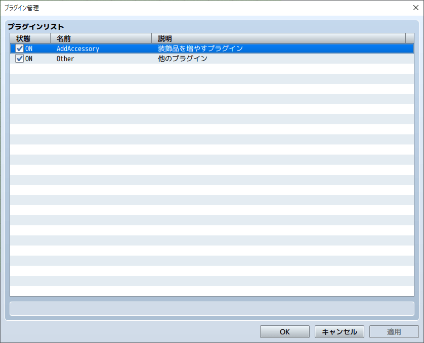

## 2-2-1. 競合対策をしよう

リード  
「前回追加した『ステータス画面をキーボードで操作可能にする』部分を解説していくよ!」

```js
const _Window_StatusEquip_initialize = Window_StatusEquip.prototype.initialize;
Window_StatusEquip.prototype.initialize = function(rect) {
    _Window_StatusEquip_initialize.apply(this, arguments);
    this.activate();
};
```

### 1. 競合対策について

「まずは、最初の部分だね。プラグインで良く使われる競合対策だよ。  
競合対策は、他のプラグインを入れたときにエラーを発生しにくくする方法だよ!」

```js
// 元の処理を記憶
const _Window_StatusEquip_initialize = Window_StatusEquip.prototype.initialize;

// 元の処理を呼び出し
_Window_StatusEquip_initialize.apply(this, arguments);
```


「上のコードのように書くと、`元の処理を記憶` して、 `元の処理を呼び出し` 出来るよ!」


「元の処理?」


「以下が『元の処理』なんだけど、この部分を呼び出しているよ!」

**・rmmz_windows.js(2946 ～ 2949行目)**
```js
Window_StatusEquip.prototype.initialize = function(rect) {
    Window_StatusBase.prototype.initialize.call(this, rect);
    this._actor = null;
};
```


「『元の処理』を呼び出すと、どうして競合対策になるんだ?」


「少し難しいから、 `競合対策しない場合` と、 `競合対策する場合` で分けて説明するよ」

### 2. 競合対策しない場合

「『装飾品を増やすプラグイン』と『他のプラグイン』が  
以下の順番になっているときを説明するよ。」




「プラグインは、プラグインリストの上から順に読み込まれるんだけど、  
同じ関数を修正した場合、上書きされてしまうんだ!  
以下は上書きされてしまう例だよ。」

**・装飾品を増やすプラグイン**  
プラグインリストの一番上にあるため、『他のプラグイン』で、  
同じ関数 `Window_StatusEquip.prototype.initialize` の変更があると  
競合対策しない限り、『装飾品を増やすプラグイン(Aの処理)』 は実行されません。

```js
Window_StatusEquip.prototype.initialize = function(rect) {
    Window_StatusBase.prototype.initialize.call(this, rect);
    this._actor = null;

    // Aの処理
    this.activate();
};
```

**・他のプラグイン**  
『装飾品を増やすプラグイン』と  
同じ関数 `Window_StatusEquip.prototype.initialize` を変更しているので、  
『他のプラグイン(Bの処理)』 は実行されますが、  
『装飾品を増やすプラグイン(Aの処理)』 は実行されません。

```js
Window_StatusEquip.prototype.initialize = function(rect) {
    Window_StatusBase.prototype.initialize.call(this, rect);
    this._actor = null;

    // Bの処理
};
```

### 3. 競合対策する場合

「競合対策をした場合を説明するよ!」

**・装飾品を増やすプラグイン**  
元の処理(rmmz_windows.js の処理)を呼び出しています。  
プラグインリストの一番上にあるので、競合対策の有無にかかわらず、  
『装飾品を増やすプラグイン(Aの処理)』 が実行されます。

```js
// 元の処理を記憶(rmmz_windows.js の処理を記憶)
const _Window_StatusEquip_initialize = Window_StatusEquip.prototype.initialize;

// 元の処理(rmmz_windows.js の処理を上書き)
Window_StatusEquip.prototype.initialize = function(rect) {
    // 元の処理を呼び出し(rmmz_windows.js の処理を呼び出し)
    _Window_StatusEquip_initialize.apply(this, arguments);

    // Aの処理
    this.activate();
};
```

**・他のプラグイン**  
元の処理も呼び出しているので、  
『装飾品を増やすプラグイン(Aの処理)』 も実行され、  
『他のプラグイン(Bの処理)』 も呼び出されます。

```js
// 元の処理を記憶(装飾品を増やすプラグイン の処理を記憶)
const _Window_StatusEquip_initialize = Window_StatusEquip.prototype.initialize;

// 元の処理(装飾品を増やすプラグイン の処理を上書き)
Window_StatusEquip.prototype.initialize = function(rect) {
    // 元の処理を呼び出し(装飾品を増やすプラグイン の処理を呼び出し)
    _Window_StatusEquip_initialize.apply(this, arguments);

    // Bの処理
};
```

### 4. 競合対策を実践してみよう

「`Game_Actor.prototype.equipSlots` も競合対策が出来るから、実践してみよう。  
以下をコピーしてみよう!  今回は動きが変わらないから、動作確認しなくても良いよ!」

上手く表示されない場合は、[こちら](https://raw.githubusercontent.com/pota-gon/MZCourse/main/2/2-2-1/AddAccessory.js) からダウンロードして  
plugins フォルダーに配置してください。

```js
/*:
 * @target MZ
 * @plugindesc 装飾品を増やすプラグイン
 * @author 自分のアカウント名
 * @help 装飾品を増やすプラグインです。
 * @url 
 */
(() => {
    'use strict';

    const _Game_Actor_equipSlots = Game_Actor.prototype.equipSlots;
    Game_Actor.prototype.equipSlots = function() {
        const slots = _Game_Actor_equipSlots.apply(this, arguments);
        slots.push(5);
        slots.push(5);
        return slots;
    };

    const _Window_StatusEquip_initialize = Window_StatusEquip.prototype.initialize;
    Window_StatusEquip.prototype.initialize = function(rect) {
        _Window_StatusEquip_initialize.apply(this, arguments);
        this.activate();
    };
})();
```


「前の呼び出し処理と少し変わってるわね。  
`const slots = _Game_Actor_equipSlots.apply(this, arguments);` って、  
何をしているのかしら?」


「元の処理 `Game_Actor.prototype.equipSlots` で `return` を使ってたよね。  
`return` で返却した配列を記憶するようにしているんだ。  
『呼び出し元』でも、`slots` の配列が使えるようになるよ!」

### 5. this.activate について

「`this.activate();` は、ステータス画面の装備一覧を選択しているよ。  
選択することで、キーボードで操作が可能になるんだ!」

```js
this.activate();
```

## 次の講座へ
次は、増やした装飾品をデータベースで装備出来るようにします。

[次の講座へ](2-2-2.md)

## 前の講座に戻る
[前の講座に戻る](2-2.md)

## 講座の一覧に戻る
[講座の一覧に戻る](../README.md)
