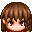
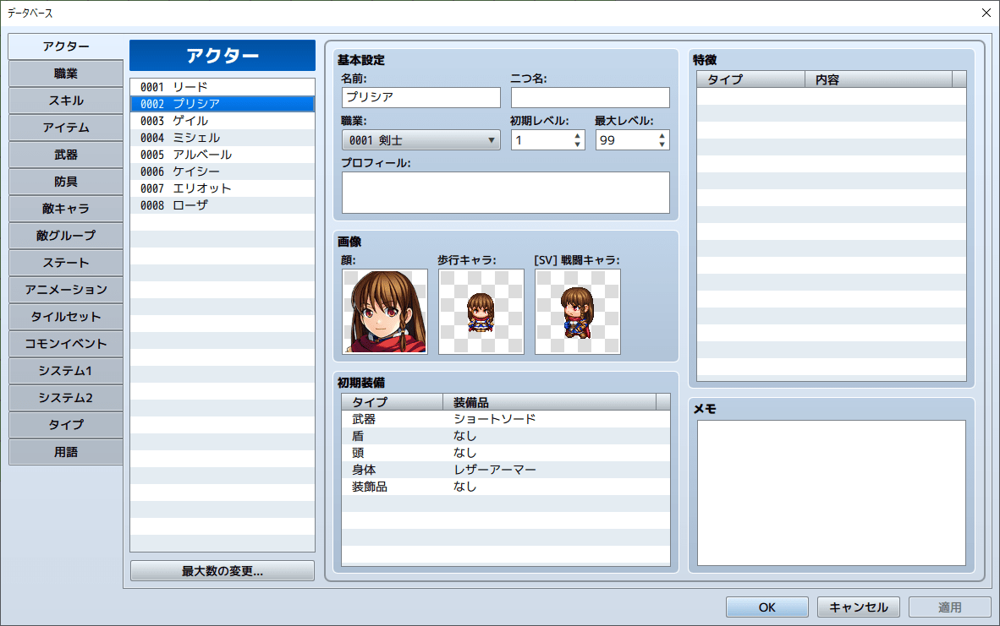
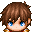
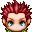
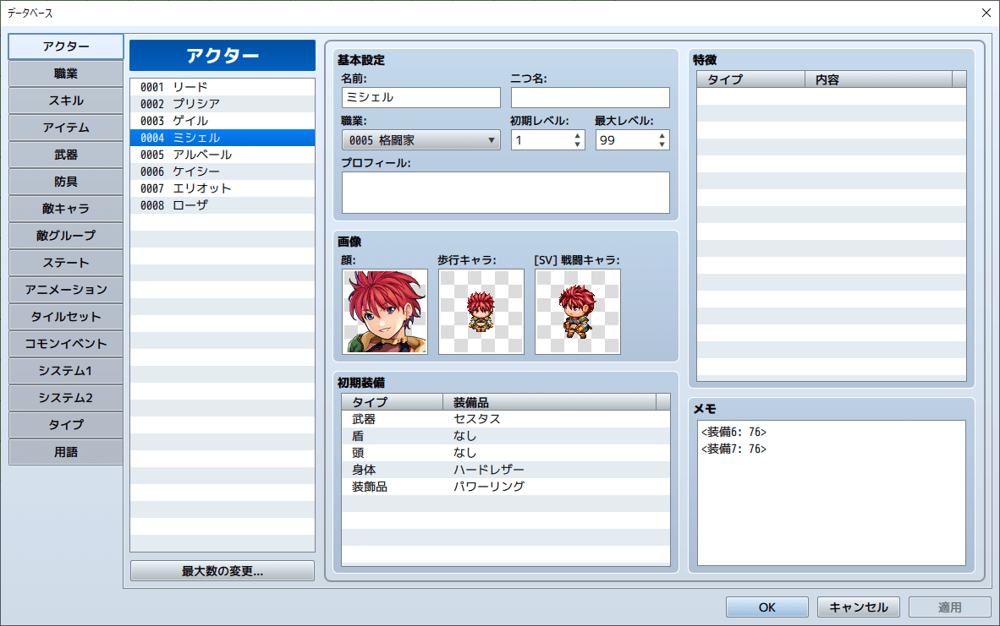
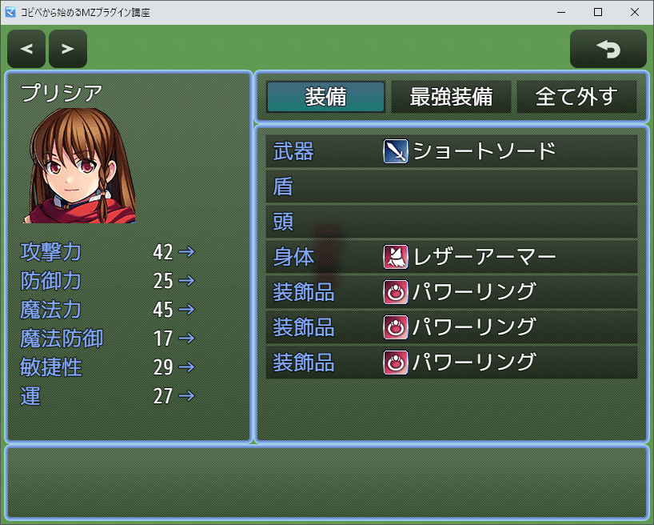

## 2-2-2. 増やした装飾品をデータベースで装備する

プリシア  
「増やしたアクセサリーがデータベースから装備できないよ!」




リード  
「そうだね。データベースはプラグインだと拡張できないから、  
メモを使って装備出来るようにしよう!」

### 1. 増やした装飾品をデータベースで装備する解説

「今回は、先に解説するよ。  
最初の部分とfor文は分かっていると思うから、説明は省略するよ。」

```js
const _Game_Actor_initEquips = Game_Actor.prototype.initEquips;
Game_Actor.prototype.initEquips = function(equips) {
    _Game_Actor_initEquips.apply(this, arguments);
    const slots = this.equipSlots();
    for (let i = 0; i < slots.length; i++) {
        let meta = this.actor().meta['装備' + (i + 1)];
        if (meta) {
            this._equips[i].setEquip(slots[i] === 1, parseInt(meta));
        }
    }
};
```

### 2. 関数の呼び出し

「以下部分は、関数 `Game_Actor.prototype.equipSlots` を呼び出しているんだ。  
関数 `Game_Actor.prototype.equipSlots` は return で装備タイプの配列を返しているから、  
slots に記憶しているよ。」

```js
const slots = this.equipSlots();
```

### 3. for文内の処理について

「`this.actor().meta` タグでアクターのメモ情報を取得しているよ。」

```js
let meta = this.actor().meta['装備' + (i + 1)];
```


「meta って何だ?」


「メモにある `<meta>` や `<meta: >` で囲まれたデータだよ。  
`meta` の部分は色々な文字が入るよ!」


「以下部分で、metaデータがあったら装備するようにしているよ!」

```js
// `<装備i: 武器 OR 防具のID>` があるかの判定
if (meta) {
    // 装備をする処理
    this._equips[i].setEquip(slots[i] === 1, parseInt(meta));
}
```

### 4. 増やした装飾品をデータベースで装備する

「以下のプラグインをコピーしよう!  
すると、アクターのメモに `<装備6: 2つ目の装飾品ID>`, `<装備7: 3つ目の装飾品ID>` を指定出来るようになるよ!」

```js
/*:
 * @target MZ
 * @plugindesc 装飾品を増やすプラグイン
 * @author 自分のアカウント名
 * @help 装飾品を増やすプラグインです。
 * @url 
 */
(() => {
    'use strict';

    const _Game_Actor_equipSlots = Game_Actor.prototype.equipSlots;
    Game_Actor.prototype.equipSlots = function() {
        const slots = _Game_Actor_equipSlots.apply(this, arguments);
        slots.push(5);
        slots.push(5);
        return slots;
    };

    const _Window_StatusEquip_initialize = Window_StatusEquip.prototype.initialize;
    Window_StatusEquip.prototype.initialize = function(rect) {
        _Window_StatusEquip_initialize.apply(this, arguments);
        this.activate();
    };

    // 追加
    const _Game_Actor_initEquips = Game_Actor.prototype.initEquips;
    Game_Actor.prototype.initEquips = function(equips) {
        _Game_Actor_initEquips.apply(this, arguments);
        const slots = this.equipSlots();
        for (let i = 0; i < slots.length; i++) {
            let meta = this.actor().meta['装備' + (i + 1)];
            if (meta) {
                this._equips[i].setEquip(slots[i] === 1, parseInt(meta));
            }
        }
    };
})();
```

### 5. データベースのメモ欄に設定してみよう!

「`<装備6: 76>` と `<装備7: 76>` で設定してみたわ。」



### 6. RPGツクールMZでの確認

「装備出来たよ!」

上手く表示されない場合は、[こちら](https://raw.githubusercontent.com/pota-gon/MZCourse/main/2/2-2-2/AddAccessory.js) からダウンロードして  
plugins フォルダーに配置してください。




リード  
「やっぱり、みんな『パワーリング』を装備するんだね・・・。」

## あとがき
このRPGツクールMZプラグイン講座は、  
プラグインを作成するための準備方法が分からない人が多いのではと思い、  
アンケートを取って反響が多かったので、作成しました。

そういった方々の助けとなれば、幸いです。  
拙い講座ですが、最後まで読んでいただきありがとうございました。

## 前の講座に戻る
[前の講座に戻る](2-2-1.md)

## 講座の一覧に戻る
[講座の一覧に戻る](../README.md)
