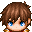

## 2-2. 装飾品3つにしよう

リード  
「次は装飾品を3つにしてみよう!」


プリシア  
「分かったよ!  
`slots.push(5);` をもう一つ増やしてみればいいよね!」


リード  
「そうだね! 早速やってみよう!」

### 1. 装飾品を3つにしてみよう!

「以下のように `slots.push(5);` を追加してみよう!  
コピーでそのまま貼り付けても大丈夫だよ!」

```js
/*:
 * @target MZ
 * @plugindesc 装飾品を増やすプラグイン
 * @author 自分のアカウント名
 * @help 装飾品を増やすプラグインです。
 * @url 
 */
(() => {
    'use strict';

    Game_Actor.prototype.equipSlots = function() {
        const slots = [];
        for (let i = 1; i < $dataSystem.equipTypes.length; i++) {
            slots.push(i);
        }
        if (slots.length >= 2 && this.isDualWield()) {
            slots[1] = 1;
        }
        slots.push(5);
        slots.push(5); // 追加
        return slots;
    };
})();
```

### 2. RPGツクールMZ上でのプラグイン確認
RPGツクールMZで、テストプレイを実施します。  
画面キャプチャの `赤枠` のように装飾品の3つ目が追加されてればOKです。

上手く表示されない場合は、[こちら](https://raw.githubusercontent.com/pota-gon/MZCourse/main/2/2-2/2/AddAccessory.js) からダウンロードして  
plugins フォルダーに配置してください。


### 3. ステータス画面で表示できるようにしよう

「ステータス画面見たら、3つ目のアクセサリーが見えないぞ?」


「装備一覧の所にカーソルを合わせてマウスをホイールすると  
3つ目のアクセサリーも表示できるんだけど、  
キーボードでも表示できると便利なので、以下をコピーして追加してみよう!」

```js
/*:
 * @target MZ
 * @plugindesc 装飾品を増やすプラグイン
 * @author 自分のアカウント名
 * @help 装飾品を増やすプラグインです。
 * @url 
 */
(() => {
    'use strict';

    Game_Actor.prototype.equipSlots = function() {
        const slots = [];
        for (let i = 1; i < $dataSystem.equipTypes.length; i++) {
            slots.push(i);
        }
        if (slots.length >= 2 && this.isDualWield()) {
            slots[1] = 1;
        }
        slots.push(5);
        slots.push(5);
        return slots;
    };

    // 追加
    const _Window_StatusEquip_initialize = Window_StatusEquip.prototype.initialize;
    Window_StatusEquip.prototype.initialize = function(rect) {
        _Window_StatusEquip_initialize.apply(this, arguments);
        this.activate();
    };
})();
```


「表示できたみたいね。」

上手く表示されない場合は、[こちら](https://raw.githubusercontent.com/pota-gon/MZCourse/main/2/2-2/3/AddAccessory.js) からダウンロードして  
plugins フォルダーに配置してください。


## 次の講座へ
次は追加した部分の解説です。  
追加部分は、競合対策もしているので解説していきます。

[次の講座へ](2-2-1.md)

## 前の講座に戻る
[前の講座に戻る](2-1-5.md)

## 講座の一覧に戻る
[講座の一覧に戻る](../README.md)
